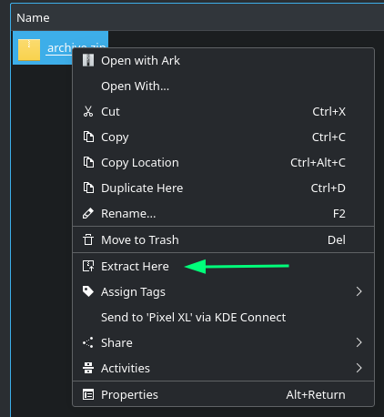
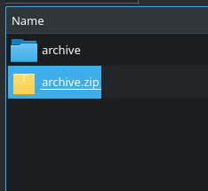

Service Menu for KDE's Dolphin file manager, adds "Extract Here" to the top
level context menu.

If the archive contains multiple files they will be extracted to a subdirectory to
prevent an archive dumping a ton of files into the current directory.

